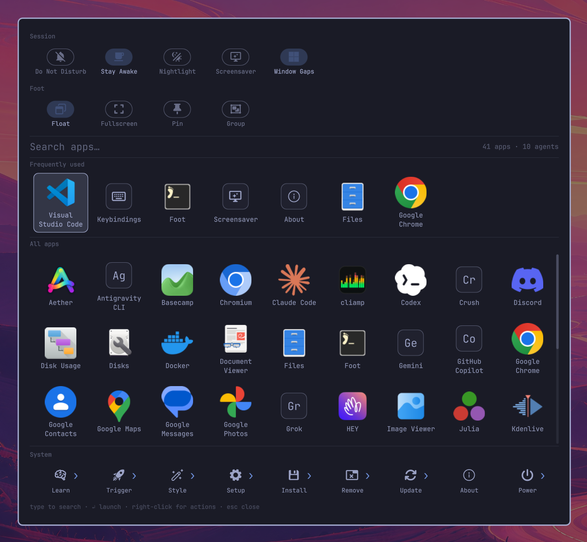

# App Launcher

One overlay for [Omarchy](https://omarchy.org/) 4.x — launch apps and coding
agents, browse the system menu as folders, and flip the switches you reach for
most.

It runs as an `overlay` plugin inside `omarchy-shell` (Quickshell), so summoning
it is an IPC call into a process that is already running — not a cold start. The
app list comes from the shell's shared `AppLibrary`, so installing or removing an
application updates the grid live, with no polling and no restart.

Coding agents (Claude Code, Codex, Gemini, …) appear alongside applications and
launch into a terminal.

Two rows of toggles sit above the search field: **Session** switches (Do Not
Disturb, Stay Awake, Nightlight, Screensaver, Window Gaps) and, when summoned by
keybinding, switches for the focused window (Float, Fullscreen, Pin, Group).

A **System** section pinned under the applications browses Omarchy's own menu as
folders — themes, monitors, packages, power — so the launcher answers "change my
theme" as readily as "open Chrome", by pointing rather than by remembering where
in a menu tree it lives. Rows describe the machine they are on: options your
hardware or setup cannot support are hidden, and the default you are already
running carries a ✓.



**Requirements:** Omarchy 4.x with `omarchy-shell` (Quickshell 0.3+). The
configuration wizards additionally need `gum` and `python3`, both of which ship
with Omarchy.

---

## Install

The plugin itself is a directory drop-in; the keybinding and menu rows are
separate because a plugin cannot write to those files on your behalf.

```bash
# 1. the plugin
omarchy plugin add https://github.com/Tyrsolution/omarchy-app-launcher.git --enable --yes

# (or by hand)
# git clone https://github.com/Tyrsolution/omarchy-app-launcher.git \
#     ~/.config/omarchy/plugins/tyrsolution.app-launcher
# omarchy-shell shell rescanPlugins
# omarchy plugin enable tyrsolution.app-launcher left

# 2. a keybinding — add to ~/.config/hypr/bindings.lua
#    o.bind("SUPER + A", "App Launcher", "omarchy-shell shell toggle tyrsolution.app-launcher '{}'")

# 3. the Setup menu rows — copy the setup.applauncher.* block from
#    docs/omarchy-menu.jsonc into ~/.config/omarchy/extensions/omarchy-menu.jsonc

# 4. check it
omarchy plugin list | grep app-launcher
omarchy-shell shell toggle tyrsolution.app-launcher '{}'
```

Step 3 is optional: everything it exposes can also be done from a shell. Without
it you simply lose the guided wizards under Setup.

---

## Using it

| Open it with | What it runs | Window toggles |
|---|---|---|
| `SUPER + A` | `omarchy-shell shell toggle tyrsolution.app-launcher '{}'` | shown |
| The ▦ button in the bar | the same IPC toggle — click to open, click again to close | hidden |
| Any script | `omarchy-shell shell toggle tyrsolution.app-launcher '{}'` | shown |

**Use the keybinding when you want the window switches.** They are deliberately
withheld from the bar button — moving the pointer there changes which window is
focused, so the row would be aimed at the wrong one. The reasoning is under
[Mouse](#mouse); the short version is that only the keyboard leaves the focused
window where you left it.

### Keyboard

| Key | Action |
|---|---|
| any character | filter as you type (name, generic name, comment, keywords, acronym) |
| `↑` `↓` `←` `→` | move the selection; up/down crosses between the toggle rows, the grids and the System strip, keeping your column |
| `Home` / `End` | first tile / last tile |
| `Enter` | launch the selection — open it on a System folder, flip it on a toggle |
| `Menu` | context menu for the selection |
| `Esc` | unwind one step: clear the filter, then leave the folder, then close |
| `Backspace` | edit the filter, or leave the folder when the filter is empty |

### Mouse

Click a tile to launch it. Hovering moves the selection. Right-click opens the
context menu: an app offers its `.desktop` actions (Chrome's *New Incognito
Window*, a terminal's *New Window*, …), *Reset usage ranking*, and *Remove from
launcher…*; an agent offers *Set as default agent* instead.

Click a toggle to flip it. The launcher stays open, so a switch behaves like a
switch rather than a menu item, and the pill updates in place once the change
takes effect.

The window toggles appear only when the launcher is opened by keybinding. Focus
follows the mouse on Omarchy, so reaching for the bar button drags focus across
every window the pointer crosses — by the time the grid is up, the "focused
window" is whatever it last passed over rather than the one you were aiming at.
Rather than offer switches pointed at the wrong window, the row is withheld on
that path. A hotkey has no such travel, so its context is trustworthy.

A System tile marked `›` is a folder: clicking it replaces the grid with its
contents and puts a **‹ Back** target and a breadcrumb where *All apps* normally
sits. Tiles without the marker run immediately. The System strip stays put while
you browse, so any other branch is one click away — nothing here needs the
keyboard.

> **What *Remove from launcher…* does.** It hands off to the stock
> `omarchy-remove-launcher-entry`, exactly as Omarchy's own Apps menu does. For a
> desktop entry in your home directory it deletes that file. For an app owned by
> a package it **uninstalls the package** — `sudo pacman -Rns <pkg>` in a visible
> terminal, so you see the command and authenticate before anything happens.
> Web apps and TUI entries go through Omarchy's own remove flows. Clicking outside the card closes it.

### Payload options

```bash
omarchy-shell shell toggle tyrsolution.app-launcher '{"query":"chr"}'     # open pre-filtered
omarchy-shell shell toggle tyrsolution.app-launcher '{"iconScale":1.4}'   # bigger icons
omarchy-shell shell toggle tyrsolution.app-launcher '{"fontFamily":"Inter"}'
omarchy-shell shell toggle tyrsolution.app-launcher '{"source":"bar"}'    # hide the window toggles
```

---

## What you see

**Toggles** — two rows above the search field. *Session* acts on the machine;
the second row acts on the window behind the launcher and is titled with it, so
it is never a mystery what is about to change. That second row appears only when
the launcher is opened by keybinding — see [Using it](#using-it). On is drawn as a filled pill as
well as a colour change, so it does not depend on telling two hues apart. A
switch Hyprland would refuse — Pin on a tiled window — is shown disabled rather
than pretending the click will work.

Omarchy's menu carries these as plain rows with no declared state, so the
launcher reads each one itself: a flag file, a Hyprland flag file, a status
script, or a shell IPC call depending on the toggle. All of it is answered by
one batched shell pass per summon.

**Frequently used** — one row, most-launched first, containing only things you
have actually launched. Each launch adds 1 to a score that halves every two
weeks, so a daily driver holds its place without pinning while last month's
one-off drifts out. On a fresh install the section is absent entirely rather
than filled with a guess.

**All apps** — everything else alphabetically, in a scrolling grid with a
draggable scroll bar. The viewport snaps to whole rows, so the bottom row is
never sliced in half.

Typing collapses both into a single relevance-ranked grid; matching agents lead,
since typing three letters of an agent's name should not put it three rows down.

**System** — Omarchy's menu, flattened into folders and pinned below the grid so
it never has to be scrolled to. Nine tiles (Learn, Trigger, Style, Setup,
Install, Remove, Update, About, Power) drill in place; a `›` marks the ones that
open rather than run. Typing collapses the tree instead of filtering one folder,
because search beats navigation once you know the word — the strip then lists
ranked matches from every leaf, labelled with the folder each came from. Rows
run the same command the menu would, and earn frecency like applications, so one
you use daily can climb into *Frequently used*.

Menu rows carry conditions, and they are honoured: `Hibernate` is absent where
it is unavailable, *Stop Screenrecording* only while recording, and a folder
whose every entry is hidden disappears rather than opening onto nothing. The
defaults you are on — agent, browser, terminal, editor — carry a ✓. These are
answered in one batched shell pass per summon, so opening never waits on them.

**Badges.** A tile whose desktop entry appeared since the last time you closed
the launcher carries an accent dot, and the footer counts them. Closing the
launcher marks everything on screen as seen.

**Theme.** Colors, fonts, corner radius, and border style come from the shared
`qs.Commons` tokens, so it re-themes with `omarchy theme set`.

---

## Configuring it

Everything lives under **Omarchy menu › Setup › App Launcher**, also reachable as
`omarchy menu summon applauncher`:

| Row | What it does |
|---|---|
| Open Launcher | Same toggle as `SUPER+A` |
| Add Application | Guided prompts that write a real desktop entry |
| Add Coding Agent | Guided prompts that add a CLI agent to `agents.json` |
| Remove Coding Agent | Picks from the agents you added; built-ins are not editable here |
| Edit Agents File | Opens `agents.json` in `$EDITOR` for hand-tuning flags |
| Reset Usage Ranking | Deletes `usage.json`, emptying *Frequently used* |

The wizards live in this plugin's `bin/` and run fine on their own:

```bash
bin/app-launcher-add-app        # write a desktop entry
bin/app-launcher-add-agent      # add a CLI agent
bin/app-launcher-remove-agent   # remove one you added
```

### Adding an application

*Add Application* writes `~/.local/share/applications/<name>.desktop` rather than
a launcher-private entry, on purpose: a desktop entry is the system's own
registry, so the app appears in this launcher, Omarchy's Apps menu, and anything
else that reads XDG entries. This launcher watches those directories, so the tile
shows up immediately — no restart, no rescan.

Use it for AppImages, hand-installed binaries, and scripts. Anything installed by
a package manager already ships its own desktop entry.

### Adding a coding agent

Omarchy's agent roster is a fixed list, so anything else goes in:

```
~/.config/omarchy/app-launcher/agents.json
```

```json
{
  "version": 1,
  "agents": [
    {
      "id": "antigravity",
      "name": "Antigravity CLI",
      "command": ["agy", "--dangerously-skip-permissions"],
      "monogram": "Ag"
    }
  ]
}
```

| Field | Meaning |
|---|---|
| `id` | Required. Names the frecency key (`agent:<id>`). Letters, digits, `.`, `_`, `-`. |
| `name` | Shown on the tile. Defaults to the id. |
| `command` | argv to run. `command[0]` is the binary probed with `command -v` — an agent that isn't installed simply doesn't appear. Defaults to `[id]`. |
| `monogram` | One or two characters for the tile. Derived from the name if omitted. |
| `icon` | Optional. An absolute path / `file://` URL, or an icon-theme name. Wins over the monogram. |

An entry whose `id` matches a built-in **replaces** it, so you can override the
shipped flags for `claude` or `codex` without editing plugin code.

The file is watched: saving it updates the launcher immediately, even while it is
open. Invalid JSON is ignored rather than clearing your agents.

---

## How agents are launched

Omarchy models agents as *one default, launched by `omarchy-agent`* — there is no
command for "launch agent X without changing the default". So an agent tile runs
the agent's own argv through Omarchy's terminal launcher:

```
[[ -d "$HOME/Work" ]] && cd "$HOME/Work"
exec omarchy-launch-tui --app-id=org.omarchy.agent <agent> <flags…>
```

That matches what Omarchy's own agent keybinding produces: the shared
`org.omarchy.agent` app-id (so existing window rules and themes still apply),
each agent's own spelling of "don't stop to ask", and `~/Work` as the working
directory because agents refuse to remember trust for `$HOME`.

Clicking a tile **does not change your default agent**. To change it, right-click
and pick *Set as default agent*, which runs `omarchy default agent <name>` — that
sets it and opens it, which is what the omarchy command does.

The built-in flag table lives in `Agents.js` and mirrors
`/usr/share/omarchy/bin/omarchy-agent`, which is the source of truth: if that
script gains an agent or changes a flag, update the roster to match. The roster
is re-probed on every summon (`command -v` in a non-login shell), so an agent
installed since the last open just shows up.

---

## State

Two files, both safe to delete — deleting `seen.json` re-baselines the badges,
deleting `usage.json` empties *Frequently used*:

```
~/.local/state/omarchy/app-launcher/usage.json   # frecency scores (agents "agent:<id>", menu rows "cmd:<menu id>")
~/.local/state/omarchy/app-launcher/seen.json    # desktop ids seen at last close
```

Both survive reboots and logout/login: scores are written on every launch, not on
exit, and atomically (temp file + rename), so an interrupted write cannot corrupt
them. Scores for apps that no longer exist are pruned when the launcher closes;
menu rows count as live for that purpose, and if the menu failed to load they are
kept rather than pruned, so a bad read cannot cost you their ranking.

To reset by hand, **close the launcher first** — a live instance rewrites
`usage.json` from memory when it closes.

---

## Uninstalling

```bash
omarchy plugin remove tyrsolution.app-launcher --yes
```

That disables it over IPC (which drops the bar button out of `shell.json`) and
deletes the plugin directory. Because the directory is a git checkout, it is
deleted outright rather than backed up — the repo is upstream.

It deliberately leaves four things behind, none of which break anything:

| Left behind | Why, and how to clear it |
|---|---|
| `~/.local/state/omarchy/app-launcher/` | Your rankings and badge baseline, so reinstalling picks up where you left off. `rm -rf` it to forget. |
| `~/.config/omarchy/app-launcher/agents.json` | Your custom agents, same reason. |
| The `SUPER+A` binding | A plugin cannot edit your `bindings.lua`. Left in place it is a no-op that logs `summon: unknown plugin`. Delete the line to be tidy. |
| The Setup menu rows | Same reason. Left in place they point at missing scripts; delete the `setup.applauncher.*` block. |

Desktop entries written by *Add Application* are **not** removed: they are
ordinary system entries that other launchers use, not plugin state. Remove them
with `rm ~/.local/share/applications/<name>.desktop`.

## What it can do to your system

Worth knowing before installing any shell plugin, since plugins run unsandboxed
inside `omarchy-shell`:

- **At shell startup** only the bar button exists — a label with a click handler.
  The overlay is built on first summon and torn down on close (`keepLoaded` is
  deliberately unset).
- **It writes** to its own two directories only: `~/.local/state/omarchy/app-launcher/`
  and, through the wizards, `~/.config/omarchy/app-launcher/agents.json`. The
  *Add Application* wizard also writes one desktop entry under
  `~/.local/share/applications/`, which is the whole point of it.
- **It reads** the two menu files — `$OMARCHY_PATH/default/omarchy/omarchy-menu.jsonc`
  and `~/.config/omarchy/extensions/omarchy-menu.jsonc` — to build the System
  section. Read-only; it never writes either. For the toggle rows it also reads
  toggle state: flag files under `~/.local/state/omarchy/toggles/`, the status
  output of `omarchy-toggle-idle` and `omarchy-toggle-nightlight`, the shell's
  own `notifications dndState`, and `hyprctl activewindow`. All read-only, and
  the status subcommands are the ones that report without flipping anything.
- **It runs** `mkdir -p` for its state directory, `command -v` to probe which
  agents exist, `gtk-launch`/`uwsm-app` to launch an app, and
  `omarchy-launch-tui` to open an agent. Every interpolated value is
  shell-quoted. For the System section it additionally runs two things, both
  bash: one batched script per summon that evaluates the menu's own
  `when:`/`checked:` conditions, and — only when you pick a System row — that
  row's `action:` verbatim. The toggle rows add a second batched read per summon
  and, only when you flip one, that toggle's own command: a stock
  `omarchy-toggle-*` script, or a `hyprctl dispatch` for the window switches.
- **The toggles run stock Omarchy commands**, the same ones the menu's own
  toggle rows and the Hyprland keybindings run. Nothing here is a new privilege:
  the window switches are `hyprctl dispatch` calls equivalent to `SUPER+T` and
  `SUPER+F`, and the session switches are the `omarchy-toggle-*` scripts.
- **The System section is as powerful as the menu it mirrors**, and no more. Its
  commands are the ones already in your menu files, run the same way
  `omarchy menu` runs them, so picking *Shutdown* shuts down and picking a
  *Remove* row removes a package. Nothing is invented here and nothing is
  elevated that the menu would not elevate; a row that needs root prompts for it
  the same way. If you would not want a command one click away, remove it from
  `omarchy-menu.jsonc` and it leaves the launcher too.
- **It never** reaches the network or writes outside the paths above. It does not
  elevate privileges on its own — the paths that can escalate are *Remove from
  launcher…*, described above, and whichever System rows your menu defines, both
  of which surface the command first.

## Troubleshooting

**Nothing opens.** `omarchy plugin list | grep app-launcher` should show `enabled`.
If not: `omarchy-shell shell rescanPlugins && omarchy plugin enable tyrsolution.app-launcher left`.

**`SUPER+A` does nothing.** `hyprctl binds -j | grep -i "App Launcher"` should
find it, and `hyprctl configerrors` should be empty.

**An agent tile is missing.** Its binary must resolve in a non-login shell:
`bash -c 'command -v <binary>'`. Agents installed through mise are on the shell's
PATH already; something installed only by a shell profile will not be found.

**A newly installed app has a generic icon.** The launcher re-indexes icons each
time it opens, so reopen it. If it persists, the package shipped no themed icon.

**Edits to the QML do nothing.** See below — plugin code needs a shell restart.

---

## Hacking on it

```
manifest.json   plugin id, kinds (overlay + bar-widget), entry points
AppGrid.qml     the overlay: state, IO, layout, keyboard, context menu
Usage.js        frecency arithmetic and state (de)serialization
Agents.js       the coding-agent roster, launch argv, custom roster parsing
Menu.js         the Omarchy menu: JSONC parsing, folder tree, guard batching
Toggles.js      the toggle table, its batched state read, and row building
BarWidget.qml   the bar button
bin/            the gum wizards the Setup menu rows call
```

**After editing the QML, run `omarchy restart shell`.** Omarchy watches
`~/.config/omarchy/plugins/` and logs `Local plugin changed, reloading`, but in
practice the engine keeps serving the already-compiled component, so edits do not
take effect until the shell restarts. `manifest.json` changes are picked up by
`omarchy-shell shell rescanPlugins`.

```bash
journalctl --user -f | grep 'qml:'      # console.log/warn from the plugin
omarchy plugin validate ~/.config/omarchy/plugins/tyrsolution.app-launcher
omarchy plugin list | grep app-launcher
```

The overlay deliberately does **not** set `keepLoaded`, so it is built fresh on
each summon and reads its state files each time.

---

## Forking it

Fork freely — but if you publish a fork, rename the plugin id so the two cannot
collide in someone's `~/.config/omarchy/plugins/`. Every reference:

| File | Reference |
|---|---|
| `manifest.json` | `"id"` |
| `BarWidget.qml` | `moduleName`, and the id inside the IPC string |
| `AppGrid.qml` | the `pluginId` fallback; optionally `stateDir` and `agentConfigPath` |
| `~/.config/hypr/bindings.lua` | the `SUPER+A` action |
| `~/.config/omarchy/extensions/omarchy-menu.jsonc` | the toggle action and the three `bin/` paths |
| `~/.config/omarchy/shell.json` | the bar layout entry (or re-enable the plugin) |
| `AppGrid.qml` | `WlrLayershell.namespace`, if you write layer rules against it |

Changing `stateDir` or `agentConfigPath` moves your frecency data and custom
agents; leaving them alone keeps both across a rename.

## License

MIT — see [LICENSE](LICENSE).
